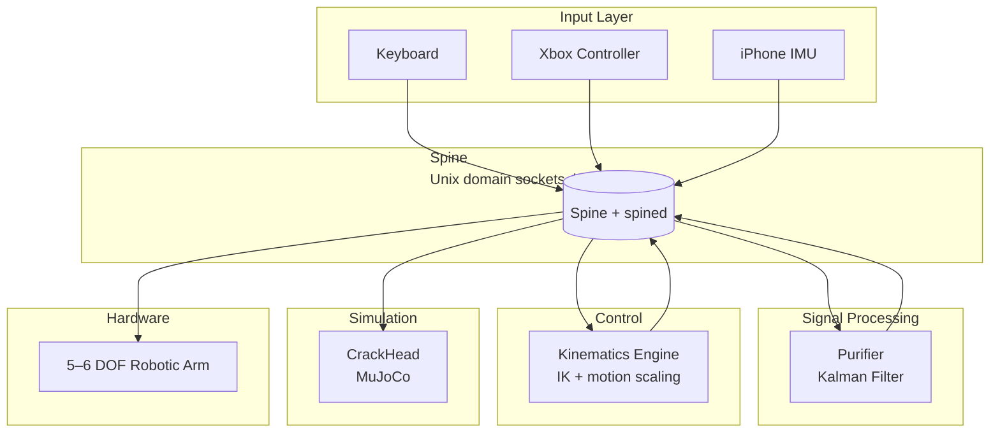

# Architecture

PreciCore is designed as a graph of loosely coupled nodes connected by Spine. Each node has a single responsibility and communicates exclusively through pub/sub or RPC — no direct function calls between nodes. This page describes the intended architecture from the team's Capstone Proposal and is explicit about which parts of it are verified working code today versus design intent for later phases.

## System diagram (as proposed)

A sixth piece sits outside this diagram: **Big-Boss**, a desktop application described in the proposal as the operator-facing orchestrator — it launches and manages the node graph, renders a live visualization of the arm and camera feed, and persists node output to a log store for replay. No implementation of Big-Boss was found in the codebase surveyed for this documentation; it's included here because it's part of the intended architecture, not because it's running code.

## What's verified working vs. proposed

| Piece | Status |
|---|---|
| Spine (pub/sub + RPC over Unix domain sockets, local machine) | **Working** — see [Spine Overview](/docs/spine/intro) |
| `spined` (local node/entity registry) | **Working**, but currently a bookkeeping layer only, not on the data path |
| Kinematics Engine | **Real code exists** (Python, `roboticstoolbox` + numerical IK) — but see [Kinematics Engine](/docs/spine-nodes/kinematics-engine/intro) for how it differs from the C++/RCM description below |
| Purifier, CrackHead, Input nodes (keyboard/Xbox/iPhone IMU), Big-Boss | **Not found in the codebase** — described here per the proposal, status is design/planned |
| Cross-machine Spine (multiple physical machines) | **Not implemented** — no transport exists beyond local Unix sockets yet |

## Data flow (as designed)

| Step | Description |
|------|-------------|
| 1. Operator input | Xbox controller / keyboard (bench validation) or iPhone IMU (wrist-motion capture) publishes a raw 4×4 delta transform |
| 2. Tremor filtering | Purifier applies the Kalman filter described in [Purifier](/docs/spine-nodes/purifier/intro) to remove physiological tremor before any downstream computation |
| 3. Routing | Spine delivers the message locally over a Unix domain socket — see [Spine Overview](/docs/spine/intro) for what "routing" does and doesn't mean today |
| 4. Inverse kinematics | Kinematics Engine composes the filtered transform against the arm's current endpoint and solves for joint angles — see [Kinematics Engine](/docs/spine-nodes/kinematics-engine/intro) for the actual solver in use |
| 5. Execution | Joint angles, together with an independently streaming Camera feed, drive CrackHead (simulation) and, eventually, the physical arm |

The proposal's stated architectural property here is that CrackHead and the physical arm are meant to be indistinguishable from upstream nodes' point of view — same Spine topics, same message shapes — so control/vision/input development isn't blocked on hardware availability. That property depends on CrackHead actually existing and publishing through Spine with the same schema as the real hardware driver; neither piece was found in the codebase, so this is a design goal to validate once they're built, not something to assume is already true.

## Design principles

**Everything is a node.** Input devices, filters, simulators, and hardware drivers are all meant to be Spine nodes, decoupled from each other.

**Namespaces isolate subsystems, in principle.** The proposal describes using Spine namespaces to isolate logical subsystems (control, vision, simulation) sharing a machine or network. In the current implementation, `spined` only supports a single namespace (`"common"`), so this isolation isn't available yet — see [Spine Overview](/docs/spine/intro).

**Simulation-first development.** CrackHead is intended to be mandatory in the development workflow — every trajectory validated in simulation before it reaches real hardware. This is a process goal; it doesn't yet have simulator code behind it in this codebase.

**No centralized orchestrator, today, by omission rather than design.** There's no discovery protocol and no launch file because there's no cross-machine transport yet, not because a zero-config discovery mechanism (like mDNS) has been built. On a single machine, nodes find each other via well-known, hardcoded Unix socket paths.

## Component summary

| Component | Language (real) | Role |
|-----------|------------------|------|
| [Spine](/docs/spine/intro) | Go (primary), Python (real, different architecture), Zig (early) | Communication layer |
| [Kinematics Engine](/docs/spine-nodes/kinematics-engine/intro) | Python | Forward/inverse kinematics for a 6-joint arm |
| [Purifier](/docs/spine-nodes/purifier/intro) | — (planned) | Kalman filter on raw operator input |
| [CrackHead](/docs/spine-nodes/crack-head/intro) | — (planned, MuJoCo-based) | Physics simulation |
| [Input nodes](/docs/spine-nodes/input/intro) | — (planned) | Keyboard, Xbox, iPhone IMU |

Note on degrees of freedom: the proposal describes the arm as both "5-DOF" (Embedded Hardware Layer, RCM sections) and "6-DOF" (CrackHead section) in different places. The actual `kinematics-engine` code defines a 6-joint `DHRobot` chain against a URDF named `arctos.urdf`. Which figure is authoritative for the physical build is a hardware-team question, not something this documentation can resolve from software alone.
