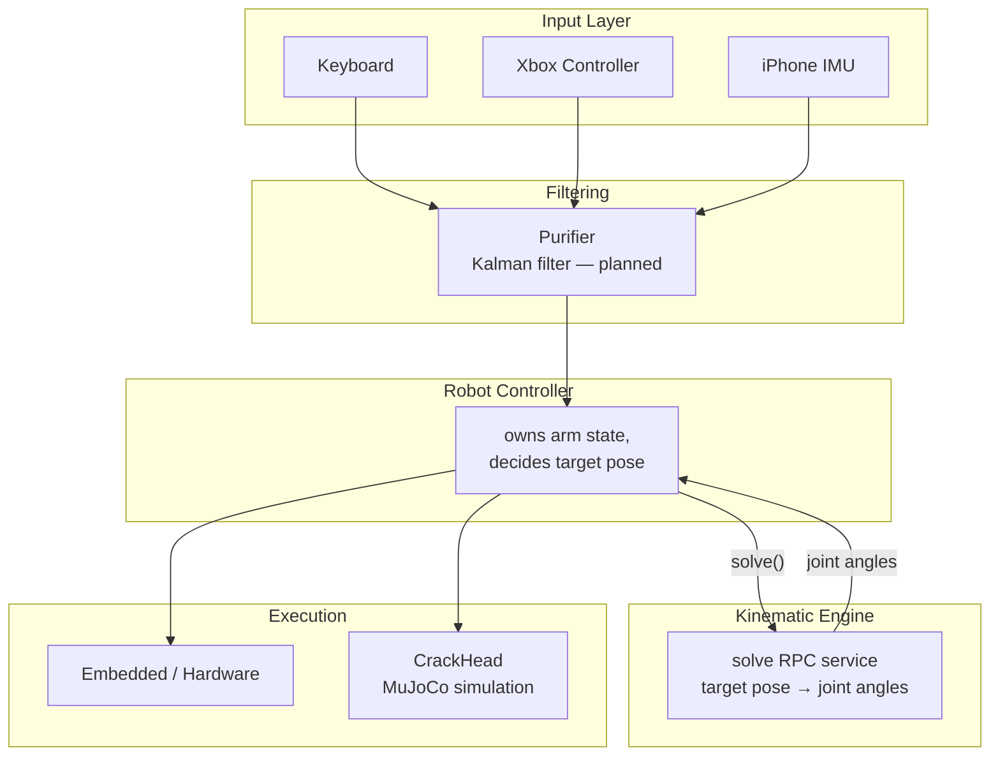

# Architecture

PreciCore is a graph of loosely coupled nodes connected by Spine. Each node has a single responsibility and communicates exclusively through pub/sub or RPC — no direct function calls between nodes. This page is explicit about three different states a piece of this system can be in: **built** (real code, on the current Unix-socket transport), **built on the old transport** (real, validated logic from an earlier KCP/mDNS-based iteration of Spine, not yet ported), and **planned** (no implementation yet).

## System diagram (target architecture)

This is the target shape, drawn from the node graph in the `big-boss` visualizer's own reference schema (see [Big-Boss](/docs/spine-nodes/big-boss/intro)): **Robot Controller and Kinematic Engine are two separate nodes**, with the controller calling kinematics as a stateless RPC (`solve`) rather than kinematics directly consuming operator input itself. That's a deliberate separation, not yet how the one real kinematics implementation works today — see [Kinematics Engine](/docs/spine-nodes/kinematics-engine/intro) for the gap between this diagram and the current code.

A seventh piece sits outside the data-flow diagram: **[Big-Boss](/docs/spine-nodes/big-boss/intro)**, the operator-facing desktop app — it's meant to launch/manage the node graph, visualize it live, and gather logs. A real (if not-yet-connected-to-live-data) implementation of this one already exists, unlike most of the other planned pieces.

## What's actually built vs. planned

| Piece | Status |
|---|---|
| Spine (pub/sub + RPC over Unix domain sockets, local machine) | **Built** — Go and Zig implementations, wire-compatible. See [Spine Overview](/docs/spine/intro) |
| `spined` (local node/entity registry) | **Built** — bookkeeping layer, not on the data path yet |
| Kinematic Engine | **Built and running**, on the current transport — a Zig node using [`red`](/docs/spine-nodes/kinematics-engine/intro) (a from-scratch DLS solver) for the actual math, replacing an earlier Python/`roboticstoolbox` solver. Doesn't yet implement the Robot Controller/Kinematic Engine split below. See [Kinematics Engine](/docs/spine-nodes/kinematics-engine/intro). |
| CrackHead (simulation) | **Built and running**, on the current transport — a real MuJoCo scene of the arm, written in Zig, subscribing to live joint angles. See [CrackHead](/docs/spine-nodes/crack-head/intro). |
| Input nodes (keyboard, iPhone IMU) | **Built and running**, on the current transport — verified as part of the live input → kinematics → simulation pipeline. Xbox Controller has no code in this checkout yet. See [Input](/docs/spine-nodes/input/intro). |
| Big-Boss | **Built as a UI shell** — a working Wails/Svelte desktop app, but it renders a hardcoded example graph, not a live namespace. See [Big-Boss](/docs/spine-nodes/big-boss/intro). |
| Robot Controller (as its own node, separate from kinematics) | **Not built** — the separation shown in the diagram above is target architecture, not existing code. |
| Purifier | **Not built** — no code, design only (a Kalman filter, see [Purifier](/docs/spine-nodes/purifier/intro)). |
| Cross-machine Spine | **Not implemented** — no transport exists beyond local Unix sockets yet. |

## Data flow (target)

| Step | Description |
|------|-------------|
| 1. Operator input | Xbox controller / keyboard (bench validation) or iPhone IMU (wrist-motion capture) publishes operator intent |
| 2. Tremor filtering | Purifier (planned) removes physiological tremor before any downstream computation |
| 3. Control | Robot Controller composes the filtered input against the arm's current state and decides a target end-effector pose |
| 4. Inverse kinematics | Robot Controller calls Kinematic Engine's `solve` service with the target pose; gets back joint angles (and a reachability flag) |
| 5. Execution | Robot Controller sends the resulting joint command to both the embedded/hardware driver and CrackHead identically, so simulation and hardware are indistinguishable consumers |

Property 5 is the same "sim and hardware see identical messages" goal from earlier drafts of this documentation — it depends on the Robot Controller/Kinematic Engine split actually being built and both consumers agreeing on one schema. That condition doesn't hold yet: there's no separate Robot Controller node, even though CrackHead itself is now on the current transport and receiving live joint angles.

## What input nodes actually publish today

- **Keyboard** and **iPhone IMU** both publish a `[4][4]float64`, running on the current transport — the iPhone IMU node computes a pure-rotation delta transform from consecutive orientation readings (small deltas under ~1° are zeroed as noise), and the keyboard node nudges translation components of an identity matrix per key held.
- **Xbox controller** is documented on the same `[4][4]float64` assumption for consistency (see [Xbox Controller](/docs/spine-nodes/input/xbox-controller/intro)), but no code for it exists in this checkout to confirm against.

## Design principles

**Everything is a node.** Input devices, filters, controllers, kinematics, and drivers are all meant to be Spine nodes, decoupled from each other.

**Kinematics is a stateless service, not a subscriber.** The target architecture calls kinematics via RPC (request a pose, get back joint angles + reachability) rather than having it directly subscribe to filtered input — the current `kinematic-engine` node doesn't do this yet, it still subscribes to displacement input and owns joint state directly.

**Simulation and hardware are meant to be interchangeable consumers.** Both are meant to receive identical joint commands from the Robot Controller — not yet true in practice, since there's no Robot Controller node yet for either to receive commands from (CrackHead currently gets joint angles straight from `kinematic-engine`).

**Namespaces isolate subsystems, in principle.** `spined` only supports a single namespace (`"common"`) today, so this isolation doesn't exist yet — see [Spine Overview](/docs/spine/intro).

**No centralized orchestrator, today, by omission rather than design.** There's no discovery protocol because there's no cross-machine transport yet. On a single machine, nodes find each other via well-known, hardcoded Unix socket paths.

## Component summary

| Component | Language (real) | Role |
|-----------|------------------|------|
| [Spine](/docs/spine/intro) | Go and Zig, wire-compatible | Communication layer |
| [Kinematic Engine](/docs/spine-nodes/kinematics-engine/intro) | Zig, using `red` for the math | Forward/inverse kinematics |
| [CrackHead](/docs/spine-nodes/crack-head/intro) | Zig + MuJoCo | Physics simulation |
| [Input nodes](/docs/spine-nodes/input/intro) | Go | Keyboard, iPhone IMU (running); Xbox Controller (no code yet) |
| [Big-Boss](/docs/spine-nodes/big-boss/intro) | Go + Wails/Svelte | Namespace visualizer, planned runner/log-gatherer |
| [Purifier](/docs/spine-nodes/purifier/intro) | — (planned) | Kalman filter on raw operator input |

## The target robot platform

The physical arm hasn't been finalized, but the leading candidate — and the only one with real code targeting it — is **Arctos**, a 6-joint open-source arm. Every piece of kinematics/simulation code (`red`'s hardcoded joint parameters, CrackHead's MJCF scene and STL meshes, and the earlier Python `kinematic-engine`'s DH chain before it) targets Arctos specifically and agrees on 6 joints.

This also resolves an old inconsistency: earlier documentation (and the Capstone Proposal itself) mentions both "5-DOF" and "6-DOF" for the arm. The hardware is 6-DOF. The 5-DOF figure most likely comes from `red`'s IK solver having a mode that treats the *task* as 5-DOF for tools with rotational symmetry about their own axis (drills, grippers) — position and pointing direction solved exactly, rotation about the tool's own axis left free. Six joints, occasionally a five-dimensional task.
