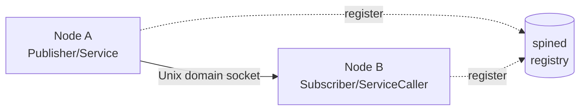

# Spine

Spine is PreciCore's communication layer — the alternative to running ROS 2 for a system this size. It gives every module two primitives, **Services** (RPC) and **Pub/Sub**, defined with native generics instead of `.proto`/`.msg` files, and (per the project's design intent) a hybrid transport that stays local when it can and hands off to a sidecar daemon, `spined`, when it can't.

Two implementations exist today — [spine-go](/docs/spine/go/intro) and [spine-zig](/docs/spine/zig/intro) — and they're wire-compatible: a Go publisher can talk to a Zig subscriber and vice versa, verified as separate live processes for every entity type, not just assumed. Get started with either one, or see [Getting Started](#getting-started) below for both.

## What's actually implemented today

It's worth being precise about this, because the ambition and the current state are different things:

- **Local IPC is real and working.** Nodes on the same machine talk over **Unix domain sockets**, at well-known filesystem paths (`/tmp/spine/service/<namespace>/<name>`, `/tmp/spine/publisher/<namespace>/<name>`). This is the part that's actually load-bearing today.
- **`spined` is a registry, not a relay.** It's a small Zig daemon that lets a node register itself and the entities (services, publishers, callers, subscribers) it exposes, so there's a central place to see what's running. It does **not** sit on the data path — a `ServiceCaller` or `Subscriber` connects to a `Service`/`Publisher`'s Unix socket directly, without asking `spined` for anything. This means `spined` is currently optional for pure single-machine use: if it's not running, nodes fall back to "local-only mode" and keep working exactly the same way.
- **Cross-machine communication (LAN/WAN) doesn't exist yet.** There is no TCP listener, no UART transport, and no relay path anywhere in the code today. This is real, planned work, but treat any description of Spine reaching another machine as a design target, not a current capability.
- **There is no discovery protocol.** No mDNS, no service registry lookup — a client dials a deterministic, well-known socket path. Discovery is "you already know the path because the namespace and entity name are conventions."
- **There is no encryption.** Unix domain sockets are protected by filesystem permissions, which is the entire security model right now. Namespaces are a naming/isolation concept, not a cryptographic boundary.
- **Only one namespace exists.** `spined` creates exactly one namespace, `"common"`, at boot, with no way (yet) to create others. Registering a node under any other namespace name is rejected.

## The two primitives

**Services (RPC)** — turn a function into a request/response endpoint. Two execution modes: sequential (`NewService`, for handlers that touch shared state) and threaded (`NewThreadedService`, for stateless/I/O-bound handlers, one goroutine per request).

**Pub/Sub** — a publisher holds the latest value and pushes it out; subscribers poll for the latest value rather than blocking on individual messages. This fits telemetry-style data (joint state, sensor readings, filtered input) better than a message queue would, since a slow subscriber just sees a value get overwritten instead of falling behind a backlog.

Every message — key and value alike — is encoded with [MAD](/docs/spine/mad/intro), a fixed-size, reflection-driven binary codec with no schema files.

## Implementations

| Package | Language | Status |
|---|---|---|
| [spine-go](/docs/spine/go/intro) | Go | Primary implementation, tagged `v0.1.0` |
| [spine-zig](/docs/spine/zig/intro) | Zig | Full peer to spine-go — node registration, Pub/Sub, RPC, reconnect-on-drop — also tagged `v0.1.0`, cross-verified against spine-go in both directions |
| `spine` (CLI) | — | Not built — a one-line spec exists ("create a namespace, add a peer, get system info") matching the admin-operations design discussed for `spined`, but no code |

Note the naming collision to watch for: "Spine" is this whole communication layer; `spine-go`/`spine-zig` are language bindings; and `spine` (lowercase, no suffix) is specifically the planned **command-line tool** for talking to `spined` — a different thing from either, not a third language binding.

## Getting started

- [spine-go](/docs/spine/go/intro)
- [spine-zig](/docs/spine/zig/intro)

Both cover the same ground — creating a node, Pub/Sub, RPC — in each language's idiom. If you're picking one for a new node: `spine-go` has a slightly richer feature set (context-based call cancellation, sequential vs. threaded services); `spine-zig` is synchronous end-to-end and measurably lower-overhead per call as a result, at the cost of that same richness not existing yet.

## Architecture

`spined`'s role today is limited to the dotted lines — bookkeeping, not message delivery. The solid line is where the actual bytes flow.

## See also

- [spine-go](/docs/spine/go/intro) / [spine-zig](/docs/spine/zig/intro) — API and usage
- [MAD](/docs/spine/mad/intro) — the wire format
- [Architecture](/docs/architecture) — how Spine fits into the rest of PreciCore
- [Troubleshooting](/docs/troubleshooting) — namespace and connection issues you'll actually hit
